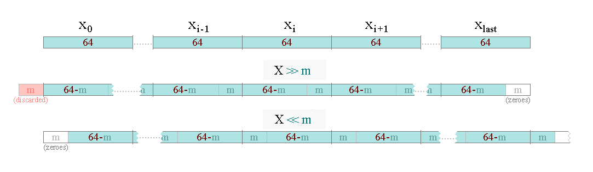

 Here I'm slowly chipping away at the goal of implementing the [RSA](https://en.wikipedia.org/wiki/RSA_(cryptosystem)) cryptosystem in C++11 completely from scratch (the only dependency being the standard library, excluding dev ones).

## Motivation

I'm enrolled for a course at the uni starting this September where the old man will make us do precisely that, as a year-long project.

Better start early, right? Nothing better to do, anyway — it's not like a have a job.

### Scope

##### Roughly the subproblems of a functional RSA implementation

1. long (*thousands of bits*) integer arithmetics, incl. shifts *(right?)*;

2. $\lambda(n)$ — [Carmichael's totient function](https://en.wikipedia.org/wiki/Carmichael_function),

   $\phi(n)$ — [Euler's totient function](https://en.wikipedia.org/wiki/Euler%27s_totient_function);

3. arithmetics modulo large prime: $+$, $-$, $\times$, $a^b$, $a^{-1}$, $gcd$, $lcm$;

4. cryptographically secure RNG;

5. big integer primality test:

   1. test divisions by a number of small primes (e.g. $< 100$);

   2. multiple [Miller-Rabin tests](https://en.wikipedia.org/wiki/Miller%E2%80%93Rabin_primality_test) with random bases

   3. followed by a single strong<sup>?</sup> [Lucas test](https://en.wikipedia.org/wiki/Lucas_primality_test), using the [FIPS 186-4 tables](http://nvlpubs.nist.gov/nistpubs/FIPS/NIST.FIPS.186-4.pdf#page=62) to decide how many to use[<sup>1</sup>](https://crypto.stackexchange.com/a/25881);

      [FIPS 186-3, 5.1 RSA Key Pair Generation](https://csrc.nist.gov/csrc/media/publications/fips/186/3/archive/2009-06-25/documents/fips_186-3.pdf);

      [FIPS 186-4, B.3.2 Generation of Random Primes that are Provably Prime](https://nvlpubs.nist.gov/nistpubs/FIPS/NIST.FIPS.186-4.pdf#page=61);

      [Handbook of Applied Cryptography, 4. Public-Key Parameters](http://cacr.uwaterloo.ca/hac/about/chap4.pdf):

      - 4.4.1 Random search for probable primes;
      - 4.51 Note *(incremental search)*;
      - 4.4.2 Strong primes

      [OpenSSL: /docs/man1.1.0/crypto/BN_generate_prime](https://www.openssl.org/docs/man1.1.0/crypto/BN_generate_prime.html).

##### The RSA itself

1. key generation algorithm:
2. encyption and decryption primitives;
3. an encryption scheme: `RSAES-OAEP` or `RSAES-PKCS-v1_5` (if the first one's too complex);
4. compatibility with the [two ways of private exponent calculation](https://en.wikipedia.org/wiki/RSA_(cryptosystem)#cite_ref-rsa_2-2);
5. [Chinese remainder-based](https://en.wikipedia.org/wiki/RSA_(cryptosystem)#Using_the_Chinese_remainder_algorithm) decryption optimization.

##### Message exchange

1. A data format for cyphertexts, public and private keys (so, basically three formats):
   1. text form — PGP uses base64 with `+`, `/` and `=`;
   2. whitespace insignificant;
   3. include insignificant labels (just like `--------BEGIN PGP PUBLIC KEY----------`) that will act as "telomeres" — would be able lose or gain a couple characters at the ends for the case of a sloppy selection.
2. CLI application:
   1. facilities for import & export of the above;
   2. *keygen*, *encrypt* and *decrypt* commands.

#### Beyond scope

Might eventually get around to some of these.

1. Both encryption schemes: `RSAES-OAEP` and `RSAES-PKCS-v1_5`;
2. One of the hashes well-supported by RSA signature software (SHA-256);
3. Signature schemes: `RSASSA-PSS`, `RSASSA-PKCS1-v1_5`;
4. PGP-like RSA-based hybrid encryption feature:
   1. A block cypher (AES256 with a mode that's secure and well-supported by GPG);
   2. RSA-based key derivation scheme (?);
   3. Back-and-forward support of GPG's encrypted messages;
5. Support an elliptic curve (or a couple) in addition to RSA.

##### Compatibility with real-world applications

1. GPG (OpenPGP standard):
   1. import/export of its keys (public and private), etc;
   2. A compression algorithm (ZIP or BZIP2);
2. SSL/TLS (???):
   1. reading X.509 certificates;
   2. interoperability with OpenSSL (`.pem`, `.der` and shit);
   3. key exchange (?).

##### Security features

1. Secure memory:
   1. compiler-proof memory erasure (at least in destructors);
   2. protection against swaps;
   3. guarded heap allocations (through a C++11-style custom allocator);
2.  Sourcing additional entropy from user environment.

### Goals

TODO

## Building

TODO

## Usage

TODO

<hr />

## Module descriptions

### `intbig_t` — arbitrary-precision integer

The number is internally represented with two data members:

```cpp
    int sign = 0;
    std::vector<uint64_t> chunks;
```

> **TODO**: replace the term "chunk" with the widely-used "limb" (it has grown on me after more research).
>

- `sign` — the number's sign: `-1` for negative numbers, `1` for positive, `0` for zero;

- `chunks` — the number's absolute value:

  - the value is stored base 64, the digits are in little-endian (ordered from least to most significant):

    $|x| = chunks[0] + 2^{64} \times chunks[1] + (2^{64})^2 \times chunks[2] + ...$;

  - leading zeroes are not allowed, so the current number's most significant digit can always be accessed as `chunks.back()` or `chunks[chunks.size() - 1]`.

> **TODO**: 2-complement representation, like Java's `BigInteger`?
>
> **TODO**: use a smaller or larger type for `sign` (it takes 8 bytes right now anyway)
>
> **TODO**: if it's smaller than `size_t`, put it at the end so theoretically something smaller than it can be aligned after the object?
>
> **TODO**: benchmark `int`-signed implementation against `bool`-signed one?

Note that the number zero has a unique representation: `{ .sign=0, chunks={} }`. All other "zero-valued" states are invalid.

If the `std::vector` is replaced with own implementation, a common trick ([GMP](https://gmplib.org/repo/gmp/file/gmp-6.1.0/gmp-h.in#l157), [CPython](https://github.com/python/cpython/blob/e42b705188271da108de42b55d9344642170aa2b/Include/longintrepr.h#L73)) is to make the size field of the "vector" signed and in the sign of it store the number's sign, thus eliminating the need for the separate `sign` field.

Not all dynamic arrays explicitly store their size, though (e.g. most `std::vector` implementations don't), and it's unclear whether this would bring any benefits other than save a couple bytes of memory (which for our application are irrelevant).

> **TODO**: Find the value for passing into `chunks.reserve()` that will allow 4096-bit modular operations with no further reallocations.
>
> *Note*: the fact that `vector` never automatically shrinks is actually pretty sweet here;

> **TODO**: Benchmark `std::vector<uint64_t>` to determine whether `emplace_back` that everyone (including `clang-Tidy`) is talking about is actually measurably faster than `push_back`. Remember to measure cases where each is called with:
>
> - an integer literal (in a loop);
> - a `uint64_t` local variable whose value is always the same;
> - a `uint64_t` local variable whose value is new each time.

##### Addition and subtraction

Now, both addition and subtraction are pretty straightforward if you just work with unsigned values:

- $a, b \in \mathbb{N_0}$ for addition;
- $a, b, a-b \in \mathbb{N_0}$ for subtraction.

You just go through pairs of digits from least to most significant, and for each of them, emit the corresponding digits of the result:
$$
c_i = (a_i \pm b_i + carry)\ mod\ N,
$$
where $carry$ is $0$ if the previous digit's computation didn't overflow, and $\pm 1$ if it did.

For `uint64_t` calculations, the $N = 2^{64}$ remainder gets taken naturally (which is [specified in the C++ standard](https://en.cppreference.com/w/cpp/language/operator_arithmetic#Overflows)), and overflow is detected by checking whether the result is

- less than either of the operands (for addition);
- greater than the minuend (for subtraction).

Additionally, the carry needs to be accounted for:

```cpp
    if(!carry) {
        return s < x;
    }
    else {
        return s <= x;
    }
```

I've done a correctness proof for this scheme, but it's too large for this `README.md`

Also, the `vector` lengths should be checked and updated appropriately:

- after subtraction — to cut off possible leading zeroes;
- before addition — to equalize the lengths of the operands *(when adding in-place)*;
- after addition — to add a new digit when needed (i.e. carry is left after the last one).

The operations are then extended onto integers in terms of each other:

- four cases addition:

  - $a + b$;
  - $a + (-b) \rarr a - b \ [\rarr -(b - a)]$;
  - $(-a) + b \rarr b - a \ [\rarr -(a - b)]$;
  - $(-a) + (-b) \rarr - (a + b)$;

- and subtraction:
  - $a - b \ [\rarr -(b - a)]$;
  - $a - (-b) \rarr a + b$;
  - $(-a) - b \rarr -(a + b)$;
  - $(-a) - (-b) \rarr b - a \ [\rarr (b - a)]$;

  *(here, $a$ and $b$ here are the absolute values of the integer arguments)*.

Now, all this is just simple arithmetics and function calls, but to implement all this without unnecessary overhead, some consideraions need to be addressed:

- unlike variable $b$ above, the actual parameter `b` you can't just be passed with another sign:

  - creating its negated copy (`-b`) is just wasteful;

  - "change the sign, then change it back" won't work either, as it's passed by `const&` (should be, at least!);

    thus, for any expression above where $b$ changes its sign, you have to traffic this information separately somehow;

- for copying operators `+` and `-`, same applies to `a`;

- for in-place operators `+=` and `-=`, every expression where the operands swap places is a call of separate method — can't just call the $b$'s method as $b$'s method computes into $b$.

Then you try to optimize around some of these obstacles and it all turns into a mush of `if`s. Anyway, here's the hierarchy I've ended up with:

- copying versions:

  these just create a copy of `*this` and call the corresponding in-place version on it;

- in-place versions:

  for every of the four combinations of signs, they express the operation as another one *on the absolute values of the numbers*, possibly with a sign flip afterwards;

  all cases where one or both operands are zero are also handled here;

- absolute versions (`private`):

  these compute into `*this` the result of one of the three operations on the absolute values: $a + b$, $a - b$, $b - a$ (including the results sign, which replaces `*this`'s sign);

- helper functions (*in the `.cpp` file*):

  these perform the three operations directly on `vector` representations, using the assumptions that we've started with — so, no signs involved.


Yeah!


##### Increment/decrement

These sure can be implemented through addition and subtraction, but a separate implementation results in much leaner code. It's probably faster, too, as, until a short circuit is implemented for `int64_t`, an actual `intbig_t` instance will have to be used as the `1`.

##### Bitwise operations

The shifts are pretty straightforward.

First shift the vector itself by $\lfloor n\ /\ 64 \rfloor$ chunks (`std::rotate` does the job really well), then shift bits inside and between individual chunks by $m = (n \bmod 64)$.



In addition to shifting each chunk's value, additional bits get "sank" from the upper chunk (in case of right shift) or "lifted" from the lower chunk (in case of left shift). As stated here, to be in-place, both operations have to run sequentially, and in the direction "opposite" to that of the shift in question.

The other ones — `&`, `|`, `^` and `~`, — are just their `uint64_t` versions applied chunk-wise, with possible leading zeroes kept in mind.

The only tricky part is the negative numbers. There are several ways of implementing bitwise operations on them, e.g.:

- refuse to do so and fail right away;
- operate on absolutes, perhaps also doing something to the signs;
- use 1's complement representations ($-x$ is represented by $\overline{x}$, the result of its bitwise flip);
- use 2's complement representations ($-x​$ is represented by $\overline{x} + 1​$).

Many x86 programmers know what shifts do to negatives there — that is, definitely the final option, with right shift drawing from a bottomless supply of `1`'s beyond the MSD.

The problem is that 2's complement is so good for fixed-width integers precisely because they overflow, allowing to (at least) add and subtract seamlessly, without distinguishing any signs. When imitating it in a "sign-and-abs" multiple-precision scenario, one bumps into quite a few edge cases.

**TODO**

...

> **TODO**: consider changing the representation to 2's complement. If decided for it, be sure to benchmark one against the other.

##### Multiplication

It's getting more complicated here. The $O(n^2)$ algorithm where you double the $a$ as go through $b$'s bits is not nearly the optimum; you have to implement either [Karatsuba](https://en.wikipedia.org/wiki/Karatsuba_algorithm) or [Toom–Cook](https://en.wikipedia.org/wiki/Toom%E2%80%93Cook_multiplication), which are on par asymptotically.

There are also FFT-based algorithms that apparently have to be mentioned in every discussion of this topic, but their big-O isn't felt before tens of thousand bytes, so it's doubtful that in our case there are any benefits to them (except, of course, an opportunity to implement the famous FFT that everyone has heard the name of but no one has ever wrote).

> **TODO**: implement some fast multiplication shit

##### Division, modulo, power

The arbitrary-precision versions of these operations aren't used by corresponding modular algorithms; thus, these operations are skipped for now.

Though basic impletementations of division and modulo are currently provided for the needs of `to_string` method, they are extremely wasteful and shouldn't be relied on.

>  **TODO**: look at how power is done in [`longobject.c`](https://github.com/python/cpython/blob/e42b705188271da108de42b55d9344642170aa2b/Objects/longobject.c#L118)

#### Todo

Implement most of the appropriate C++ opeartors:

- Assignment: `a = b`, `a += b`, `a -= b`, `a *= b`, `a /= b`, `a %= b`, `a &= b`, `a |= b`, `a ^= b`, `a <<= b`, `a >>= b`;

- Increment, decrement: `++a`, `--a`, `a++`, `a--`;
- Arithmetic: `+a`, `-a`, `a + b`, `a - b`, `a * b`, `a / b`, `a % b`, `~a`, `a & b`, `a | b`, `a ^ b`, `a << b`, `a >> b`;
- Comparison: `a == b`, `a != b`, `a < b`, `a > b`, `a <= b`, `a >= b`;

as well as some additional methods:

- Factory methods:

  - [ ] `static intbig_t from_decimal(const std::string& decimal)`;
  - [ ] `static intbig_t of(int64_t x)` (**TODO**: replace the implicit with this);
  - [ ] `static intbig_t from_hex(const std::string& hex)` (this can be done hella efficiently, no multiplicative shit);

- A custom literal? Like:

  - [ ] `"99843217232349984321723234"_big` or `99843217232349984321723234_big`;

- [x] Rule of 5 **— turns out, I don't need to define them manually given the member types**;

- [ ] either provide a `swap` or ensure that `std::swap` works (and why);

- [ ] *convert to string*:

  - [ ] `std::string to_string() const`;

    **TODO**: rename into (or make alias of?) `to_decimal`;

  - [ ] `std::string to_decimal() const`;

  - [ ] `std::string to_hex() const`;

  - [ ] `operator<<(std::ostream& os, $)`<sup>1</sup>;

- [ ] binary representation conversions:

  - [ ] from:

    - `static intbig_t from_bytes(std::string bytes)`;
    - `static intbig_t from_bytes(std::istream stream)` (reads until EOF);

  - [ ] to:

    - `std::string to_bytes()`;
    -  `void to_bytes(std::ostream stream)`;

    these are roughly the `I2OSP` and `OSP2I` from the [PKCS#1](https://tools.ietf.org/html/rfc3447#page-9) standard;

    the `I2OSP`'s parameter `xLen`, which, to my understanding, is included for overflow protection, is replaced by the following method:

  - [ ] `size_t num_bytes() const` — exactly how many bytes will the previous two methods produce;

  - [ ] as well as `size_t num_bits() const` — the length of the underlying number's binary representation, i.e. the 1-based position of its leftmost set bit (if a use is found);

    **Note**: consider copying 8 bytes at a time with `reinterpret_cast<uint64_t*>` (check if `std::strings` are contiguous, though);

- [ ] *explicit* conversions to `int`s of various sizes (throw `range_error` if doesn't fit);

- [x] `intbig_t& negate()` — non-copying version of unary `-` (basically its corresponding compound assignment);

- faster versions of some `operator`s working on `int64_t` without conversion:

  - [ ] `==` and `!=`;

  - [ ] `=`;

  - [ ] other comparisons;

  - [ ] arithmetic (additive, at least);

    *as out-of-class `friend` functions where applicable;*

- [ ] decide (not necessarily document) which [named requirements](https://en.cppreference.com/w/cpp/named_req) does and should it implement.

Notes:

- `%`, `/`, `%=` and `/=` — **for string coversions only**: don't waste time putting the efficient algorithms there — for modulo $p$ the game will most likely be completely different *(don't forget to warn in the doc comments!)*;

<sup>1</sup> — when will I finally start getting this overload right without StackOverflow?

```cpp
// .h
class MyClass {
    // ...
    friend std::ostream& operator<<(std::ostream& os, const MyClass& value)
    // ...
}

// .cpp
std::ostream& operator<<(std::ostream& os, const MyClass& value) {
	return os << /* ... */ value.x /* ... */;
}
```

#### Possible optimizations

##### Forward an allocator to the underlying `std::vector`

A custom allocator may be used to fulfill one of two goals:

- speed things up, depending on how many temporaries do we end up creating (e.g. monotonic);
- allocate (and deallocate!) with various security considerations, like the big boys in crypto do.

In either case, the `intbig_t` code will need only tiny changes, and code using its default version — no changes:

```cpp
template<typename Alloc=std::allocator<uint64_t>>
class intbig_t_alloc
{
    // ... the old intbig_t code
	std::vector<uint64_t, Alloc> data;
    // ... the old intbig_t code
};

// ...

typedef intbig_t_alloc<> intbig_t;
// This wouldn't be possible:
// typedef intbig_t<> intbig_t;
```

So don't do it early!

##### Small size optimization

In general, an SSO for numbers e.g. $< 2^{64}$ seems to apply perfectly here due to the "law of small numbers".

For working with 1024- or 4096-bit numbers, though, this is questionable. Will the allocation speedup even be noticeable? Will the locality improvement matter? Half a kilobyte is $\frac{1}{16}$ of the L1 already.

Moreover, the modular multiplication algorithm will probably both require a temporary, maybe even one larger than the operands.

##### Expression templates

All the smartest guys do those. This is essentially a way to optimize expressions at compile time, e.g. computation `a = b + c`, that would normally sum into a temporary, then move it into `a`, can be done is `a` directly, without any user intervention..

They are a huge ordeal to develop, though, and even `boost::math::multiprecision`'s documentation admits their limited merits. Moreover, at the first glance, the computations involved in RSA don't seem to involve any complex expressions that might realistically benefit from such an optimization.

#### Benchmarks

Planning to benchmark against the following implementations:

|                                                         | representation                | ex. Tx. |                             |                                                              |
| ------------------------------------------------------- | ----------------------------- | ------- | --------------------------- | ------------------------------------------------------------ |
| `GMP `                                                  | `uint64_t[]`                  | ✔️       | About the fastest it gets   | `.tar.lz`                                                    |
| `boost::mp`                                             | *varying?*                    | ✔️       | *On its own backend*        | ?                                                            |
| [`CLN`](https://ginac.de/CLN/cln.html#Modular-integers) | `uint32_t`<sup>3</sup>        | —       |                             | [git]( git://www.ginac.de/cln.git)                           |
| `intbig_t`                                              | `vector<uint64_t>`            | —       |                             | —                                                            |
| `InfInt`                                                | `vector<int32_t>` base $10^9$ | —       |                             | [GitHub](https://github.com/sercantutar/infint)              |
| `integer`                                               | `deque<uint8_t>`              | —       | Not as bad as the one below | [GitHub](https://github.com/calccrypto/integer/blob/master/integer.h) |
| `BigInteger`                                            | `std::string` (`'0'-'9'`)     | —       | The real shit               | [GitHub](https://github.com/panks/BigInteger/blob/master/BigInteger.h) |

All of them non-cryptographic, so no memory security overheads are at play.

Also, [`CLN`](https://ginac.de/CLN/cln.html#Modular-integers) seems to have modulars (`ring.h`).

<sup>1</sup> — because in English you're supposed to say "multiple precision", got it.

<sup>2</sup> — "secure memory block" with custom allocators, protecting against side-channels and shit.

<sup>3</sup> — I'm completely lost on why are these called "bytes" or wtf is "`position`":

```cpp
// BYTE-Operationen auf Integers

struct cl_byte {
	uintC size;
	uintC position;
// Konstruktor:
	cl_byte (uintC s, uintC p) : size (s), position (p) {}
};
```

*(make no mistake: `uintC` is a typedef of `uint32_t`)*

<hr />

## Links

1. google test:

   1. [Googletest Primer](https://github.com/google/googletest/blob/master/googletest/docs/primer.md);
   2. [Advanced googletest Topics](https://github.com/google/googletest/blob/master/googletest/docs/advanced.md):
      1. [Teaching googletest How to Print Your Values](https://github.com/google/googletest/blob/master/googletest/docs/advanced.md#teaching-googletest-how-to-print-your-values);
      2. [Predicate Assertions for Better Error Messages](https://github.com/google/googletest/blob/master/googletest/docs/advanced.md#predicate-assertions-for-better-error-messages);
      3. [Value-Parameterized Tests](https://github.com/google/googletest/blob/master/googletest/docs/advanced.md#value-parameterized-tests);

2. [Длинная арифметика — e-maxx.ru](http://e-maxx.ru/algo/big_integer);

3. RSA:

   1. [R.L. Rivest, A. Shamir, and L. Adleman — A Method for Obtaining Digital Signatures and Public-Key Cryptosystems](http://people.csail.mit.edu/rivest/Rsapaper.pdf);

   2. [PKCS #1: RSA Cryptography Specifications Version 2.1](https://tools.ietf.org/html/rfc3447) *(the latest verson 2.2 only expands the list of hashes with SHA-256 and others)*;

   3. [RSA — Wikipedia](https://en.wikipedia.org/wiki/RSA_(cryptosystem));

   4. [RSA and Primality Testing](https://imada.sdu.dk/~joan/projects/RSA.pdf) (slides);

   5. [RSA Laboratories — High-Speed RSA Implementation (1994)](ftp://ftp.rsasecurity.com/pub/pdfs/tr201.pdf) — mainly discusses modular exponentiation and multiplication;

   6. [Computational Complexity Analyses of Modular Arithmetic for RSA Cryptosystem](http://citeseerx.ist.psu.edu/viewdoc/download?doi=10.1.1.592.4078&rep=rep1&type=pdf);

   7. [Handbook of Applied Cryptography](http://cacr.uwaterloo.ca/hac/);

      [Chapter 4: Public-Key Parameters](http://cacr.uwaterloo.ca/hac/about/chap4.pdf) *(it's totally somewhere up there with more precise references)*;

   8. [Fast Implementations of RSA Cryptography](https://www.di.ens.fr/~jv/HomePage/pdf/rsa.pdf) *(the dates aren't too good on this, but the presentation is promising)*;

   9. [Montgomery modular multiplication](https://en.wikipedia.org/wiki/Montgomery_modular_multiplication) — explicitly advertised for RSA right there;

   10. PGP, OpenPGP, GPG:

     1. [RFC 4480 — OpenPGP Message Format](https://tools.ietf.org/html/rfc4880);
     2. [RFC 6637 — Elliptic Curve Cryptography (ECC) in OpenPGP](https://tools.ietf.org/html/rfc6637);
     3. [Anatomy of a GPG Key](https://davesteele.github.io/gpg/2014/09/20/anatomy-of-a-gpg-key/);

   11. Validation:

       1. [The 186-4 RSA Validation System (RSA2VS)](https://csrc.nist.gov/CSRC/media/Projects/Cryptographic-Algorithm-Validation-Program/documents/dss2/rsa2vs.pdf);

       2. [Project Wycheproof](https://github.com/google/wycheproof) — some test vectors;

       3. [Some other library's description](https://github.com/pyca/cryptography/blob/master/docs/development/test-vectors.rst) of where they get their test vectors;

       4. [Crypto++'s test vectors](https://github.com/weidai11/cryptopp/tree/master/TestVectors);

       5. [BoringSSL](https://boringssl.googlesource.com/boringssl/) — OpenSSL fork, has [fuzzing provisions](https://boringssl.googlesource.com/boringssl/+/HEAD/FUZZING.md) and [some tests](https://boringssl.googlesource.com/boringssl/+/ce3773f9fe25c3b54390bc51d72572f251c7d7e6/crypto/evp/evp_tests.txt);

       6. Fuzzing:

          1. [CDF – crypto differential fuzzing](https://github.com/kudelskisecurity/cdf) — a Go application;

             [`rsaenc`](https://github.com/kudelskisecurity/cdf#rsaenc-rsa-encryption-oaep-or-pkcs-15) — its interface for RSA encryption/decryption;

          2. llvm's [libFuzzer](http://llvm.org/docs/LibFuzzer.html), [AddressSanitizer](http://clang.llvm.org/docs/AddressSanitizer.html)

          3. [American fuzzy lop](http://lcamtuf.coredump.cx/afl/) (AFL) — *complex file semantics* and shit;

          4. [libFuzzer Tutorial](https://github.com/google/fuzzer-test-suite/blob/master/tutorial/libFuzzerTutorial.md);

          5. [fuzzer-test-suite](https://github.com/google/fuzzer-test-suite);

   12. Real implementations:

      1. [OpenSSL](https://wiki.openssl.org/index.php/Main_Page);

         OpenSSL's [Command Line Utilities](https://wiki.openssl.org/index.php/Command_Line_Utilities#rsa_.2F_genrsa);

         Description of [OpenSSL-related file formats](https://serverfault.com/a/9717);

      2. [Crypto++](https://www.cryptopp.com/) *(by Wai Dai the Bitcoin guy)*;

         1. [`integer.h`](https://github.com/weidai11/cryptopp/blob/master/integer.h), [`integer.cpp`](https://github.com/weidai11/cryptopp/blob/master/integer.cpp) — their big integer, probably?

            > Wei's original code was much simpler ...
            >

         2. [`modarith.h`](https://github.com/weidai11/cryptopp/blob/master/modarith.h) — modular arithmetic, incl. Montgomery representation:

            1. has `ModularArithmetic` class representing a modulus with methods accepting regular integers;
            2. [modular add/sub](https://www.cryptopp.com/docs/ref/integer_8cpp_source.html#l04494) are pretty straightforward derivatives of their non-modular versions;
            3. [`RSAPrimeSelector`](https://www.cryptopp.com/docs/ref/rsa_8cpp_source.html#l00106) — seems to just check GCD of candidate with the public exponent, which is weird;

         3. [`algebra.h`](https://github.com/weidai11/cryptopp/blob/master/algebra.h), [`algebra.cpp`](https://github.com/weidai11/cryptopp/blob/master/algebra.cpp) (its dependency) — some other mathematics;

         4. [`secblock.h`](https://github.com/weidai11/cryptopp/blob/master/secblock.h) — secure memory allocations ([this document](https://download.libsodium.org/doc/helpers/memory_management.html) from other library may provide insight into what's going on there); 

      3. [Python-RSA](https://stuvel.eu/rsa) *(not that anyone right in their mind would actually use it)*;

         [GitHub repo](https://github.com/sybrenstuvel/python-rsa), [PyPI page](https://pypi.org/project/rsa/) (LOL @ project description);

         **May be up for a pull request after I'm finished with this!**

         > Implementation based on the book Algorithm Design by Michael T. Goodrich and Roberto Tamassia, 2002.

         > Running doctests 1000x or until failure

         Found the users:

         > This software was originally written by Sybren Stüvel, Marloes de Boer, Ivo Tamboer and subsequenty improved by Barry Mead, Yesudeep Mangalapilly, and others.

4. Other relevant algorithms:

   1. bitwise operators on neagtive MP integers ([2's complement](https://en.wikipedia.org/wiki/Two%27s_complement)):

      1. [Two's Complement binary for Negative Integers](https://wiki.python.org/moin/BitwiseOperators#line-22);
      2. implementation in [`longobject.c`](https://hg.python.org/cpython/file/628acf7dbc8d/Objects/longobject.c#l4171);
      3. some fuck's [GitHub issue](https://github.com/libtom/libtommath/issues/32) and implementation in [his PHP slop](https://github.com/hikari-no-yume/php-src/blob/481bc1ea3986ab596b3a1860b1693cfa2769c845/Zend/zend_bigint_libtommath.c#L768);

   2. Cormen et el.:

      1. 32: Number-Theoretic Algorithms, p. 926;
      2. 31.8: Primality testing *(incl. Miller-Rabin primality test)*, pp. 971–975;

   3. St. Denis — BigNum Math: Implementing Cryptographic Multiple Precision Arithmetic,

      a book by the developer of [LibTomMath](https://www.libtom.net/LibTomMath/) and [LibTomCrypt](https://github.com/libtom/libtomcrypt) that are both written in C and the former reminds me a lot of GMP:

      1. [TeX source](https://github.com/libtom/libtommath/blob/develop/doc/tommath.src);
      2. [Generated PDF](https://github.com/libtom/libtommath/blob/432e3bd8eb40c4e5a40b688da6764d418b1804b2/tommath.pdf) (last version before deletion);
      3. pirated Amazon PDF looks the best, though;

   4. `std::vector` replacements:

      1. Some jerk's version: [blog post](https://www.movable-type.co.uk/scripts/sha256.html), [GitHub repo](https://github.com/dendibakh/prep/blob/master/SmallVector.cpp);

      2. [llvm/ADT/SmallVector.h](http://llvm.org/docs/ProgrammersManual.html#llvm-adt-smallvector-h) *(benchmark against this, maybe?)*;

      3. [`folly::fbvector`](https://github.com/facebook/folly/blob/master/folly/docs/FBVector.md) (Facebook/Alexandrescu);

         [FBVectorBenchmark.cpp](https://github.com/facebook/folly/blob/master/folly/test/FBVectorBenchmark.cpp) — benchmarks against several others;

      4. [nsTArray.h](https://dxr.mozilla.org/mozilla-beta/source/xpcom/ds/nsTArray.h) (Mozilla);

      5. [`lni::vector`](https://github.com/lnishan/vector) (some fuck);

      6. [`pector`](https://github.com/aguinet/pector) (some other fuck);

      7. [StackOverflow answer](https://stackoverflow.com/a/2443195): "just use `std::basic_string`!";

         (if I'm replacing `vector`, it doesn't neccessarily need to be nearly as complex as some of these: only a few methods needed, only one use-case considered);

         (some of them boast improving the `memmove` assumptions which are suboptimal in `std::vector` — does this apply to `uint64_t`, though?);

      8. `itoa`/`atoi` for big integers:

         1. [`itoa` benchmarks](https://github.com/amdn/itoa-benchmark) (for regular ints);
         2. [gay `dtoa` benchmarks](https://github.com/miloyip/dtoa-benchmark) (for regular doubles);

   5. PRNGs:

      1. [Diehard tests](<https://en.wikipedia.org/wiki/Diehard_tests);

5. [Source File Organization for C++ Projects Part 1: Headers and Sources](https://arne-mertz.de/2016/06/organizing-headers-and-sources/);

   [Source File Organization for C++ Projects Part 2: Directories and Namespaces](https://arne-mertz.de/2016/06/organizing-directories-namespaces/);

6. [C++ Dos and Don'ts](https://www.chromium.org/developers/coding-style/cpp-dos-and-donts) (Chromium);

7. GMP user manual:

   1. [Build Options ](https://gmplib.org/manual/Build-Options.html) — all I had to do was to pass  `--enable-cxx` to `./configure`, it turns out!
   2. [3.1 Headers and Libraries](https://gmplib.org/manual/Headers-and-Libraries.html#Headers-and-Libraries);
   3. [3.4 Conversions](https://ginac.de/CLN/cln.html#Conversions);
   4. [5 Integer functions](https://gmplib.org/manual/Integer-Functions.html#Integer-Functions);
   5. [5.4 Conversion functions](https://gmplib.org/manual/Converting-Integers.html);
   6. [5.12 Input and Output Functions](https://gmplib.org/manual/I_002fO-of-Integers.html);
   7. [12.2 C++ Interface Integers](https://gmplib.org/manual/C_002b_002b-Interface-Integers.html#C_002b_002b-Interface-Integers).

8. Benchmarks:

   1. [Google Benchmark](https://github.com/google/benchmark) (documented mostly in `README.md`);
      1. [`benchmark.h`](https://github.com/google/benchmark/blob/master/include/benchmark/benchmark.h) (includes some additional documentation with examples)
   2. Good-looking error bar plots:
      1. [Styling plots for publication with matplotlib](http://jonchar.net/notebooks/matplotlib-styling/);
      2. [Visualizing Errors](https://jakevdp.github.io/PythonDataScienceHandbook/04.03-errorbars.html) *(uses some "styles" to make it look good)*;
      3. [Matplotlib: beautiful plots with style](http://www.futurile.net/2016/02/27/matplotlib-beautiful-plots-with-style/) *(some kind of explanation of these `maplotlib` styles)*;
   3. [incise.org: Hash Table Benchmarks](http://incise.org/hash-table-benchmarks.html) — doctor, my lines are worrying me 🌝;
   4. [A benchmark report from criterion, a Haskell library](http://www.serpentine.com/criterion/fibber.html) — looks good;

9. [Someone really got carried away here](https://github.com/davidcastells/BigInteger) — 10 implementation of the same thing, some of which he even benchmarks against our old friend `NTL`.

